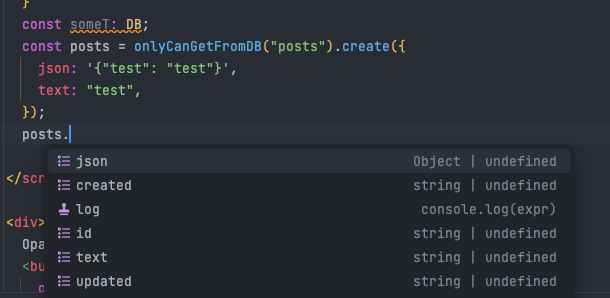

This is a proof of concept.

To run this example follow the steps:

run the Backend:

```bash
$ go get
$ go run main.go serve
```
click in the ADMIN URL and add some tables

run the Frontend:

```bash
$ npm install
$ npm start
```
Go to the pocket page and add a record (click the button) and make sure that the collection name is in `sqlite.json`.
now run in your front end terminal:

```bash
$ npm generate-types
```

It should generate a `db.d.ts` file with the types of your tables.

For my example I did create a posts table with the following fields:

``
'json'?: Object | null;
'text'?: string | null;
``

TODO:

- [ ] Better typings (I need more time reading the docs)
- [ ] Add types to sqlite.json in a automated way (maybe an api can do that)
- [ ] Better error handling
- [ ] Make it more generic (tables with some diferent names or diferent casing may break)


## How this is implemented?

I use a lib called [sql-ts](https://github.com/rmp135/sql-ts) to generate the types from the database. 
It does most of the work but at the end I just append those types to a global one.

Then I use the o.js file to make this types available in a single struct called DB.

then I map what I need in a thin layer of code as the following bellow using this DB struct:

```typescript
 
import type { DB } from "../../../db"; // import your DB struct
import PocketBase from "pocketbase";

const pb = new PocketBase("http://127.0.0.1:8090");
const get = <TP extends keyof DB>(keyOfDB: TP) => {
  return {
    getOne: (recordID: string) => {
      return pb.collection(keyOfDB).getOne(recordID) as DB[TP];
    },
    topic: pb.collection(keyOfDB).subscribe,
    create: (data: DB[TP]) => pb.collection(keyOfDB).create(data) as DB[TP],
    update: (data: Partial<DB[TP]>) => pb.collection(keyOfDB).create(data),
    delete: (recordID: string) => pb.collection(keyOfDB).delete(recordID),
  };

}
const posts = get("posts").create({
  json: '{"test": "test"}',
  text: "test",
});

```

As you can see the prints below I can use the types in my code.




